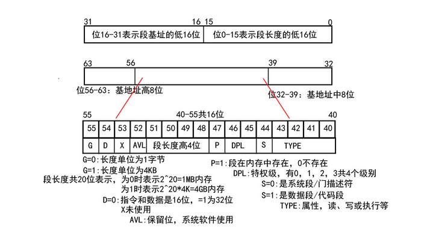

# 13day

设计鼠标指针

简单介绍下GDT：

在intel80386出现以前，都是16位的CPU，各个寄存器也是16位的。但CPU的寻址能力确实1M，这是因为寻址方式为16*段寄存器+偏移。这样的工作模式也叫实模式。在实模式下每个段是没有保护方式的。这就导致可能会有比较危险的操作。

而在之后的计算机历史中，出现了32位的CPU。为了保证向下兼容性，还是讲实模式保存了下来，只不过是在开机启动的很短时间内。之后就会进入保护模式。而保护模式就会用到GDT。因为在32位的CPU中，除段寄存器外，各个寄存器也变为了32位，这时以前的寻址方式就变得不是那么可取。

其中段寄存器中存储的是对GDT的索引，而GDT中存放的是各个段的信息，其中包括段的基地址、段的大小、段的各种属性等。且由于CPU设计上的原因，段寄存器的16位并不能完全用做索引，只有高13位可以用做索引，所以段的寻址范围为0-8191。

通过GDT的名字也可以看出，一个处理器只能有一个GDT。在系统启动之前，需要使用LGDT指令将GDT的入口装载到GDTR寄存器。CPU就会根据GDT中的值设置各个段的基地址、大小和属性等等。

感觉这个图已经说的很清楚了

再来介绍下IDT：

中断记录表，IDT记录了中断与调用号的关系